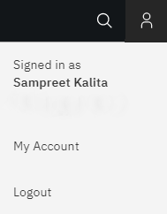
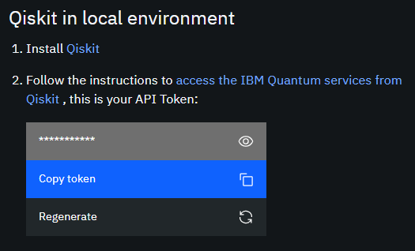

# M08T02 - The Qiskit SDK

[]((https://qiskit.org/))
[](https://qiskit.org/)

> Cloud Computing meets Quantum Computers!

[&#8592; \[Previous\] M08T01 - CBits to QBits](./m08t01-cbits-to-qbits.md)

[*Qiskit*](https://qiskit.org/) is an [open-source framework](http://doi.org/10.5281/zenodo.256211) written in Python which provides access to quantum computing platforms for learning, as well as facilitates research on quantum computation. 
Together with the [IBM Quantum Experience](https://quantum-computing.ibm.com/), it can be used to work with quantum computers at a level of circuits, pulses, and algorithms.

## Installing the SDK

### Prerequisite

* [Module 01 - Getting Started](../m01-getting-started/)

### Setting Up the Environment

The Qiskit Software Development Kit (SDK) requires a 64-bit version of Python 3.5 or later and preferably a virtual environment to avoid dependency clashes with other installed packages.

Once you have [set up Python](../m01-getting-started/m01t01-setting-up-python.md), create a new environment for the latest version of Python 3.x.x via the following command:

```bash
conda create --name qcomp python=3
```

Once the environment is created, activate it using:

```bash
conda activate qcomp
```

Update the environment to download the latest packages:

```bash
conda update --all
```

Since `qiskit` is being maintained by the default Python package manager `pip` and does not yet have a `conda` source, we need to update `pip` to its latest version before installing `qiskit`. This can be done by executing:

```bash
pip install --update pip
```

***Note: `pip` does not check for dependency clashes with previously installed packages; hence make sure you create a new environment for `qiskit` with a compatible version of Python.*** 

### Installation and Validation

Finally, install the latest version of the `qiskit` package along with visualiation functionality using:

```bash
pip install qiskit[visualization]
```

Once all packages and their dependencies are installed, check the version of `qiskit` installed via the following lines in the *interactive mode*:

```python
>> import qiskit
>> qiskit.__version__
```

A one-liner *command line* alternative for the above step is:

```bash
python -c "exec(\"import qiskit\nprint(qiskit.__version__)\")"
```

## IBM Quantum Experience API Access Token

[*IBM Quantum Experience*](https://quantum-computing.ibm.com/) is a cloud-based platform to provide access to IBM's prototype quantum processors.
It offers a variety of graphical tools to create as well as run quantum algorithms and experiments on their quantum computers. 

Create or Log In to you personal IBM Quantum Experience account from the [official webpage](https://quantum-computing.ibm.com/).

Once logged in, select on the *My Account* option available under the *Profile* icon situated at the top-right corner (or alternatively, visit the [*My Account* page](https://quantum-computing.ibm.com/account) in the same browsing environment). 



Copy the IBM API access token from the page available under the *Qiskit in local environment* section.



To save the access token in Qiskit configuration file, type the following in the *interactive mode*, replacing `api_access_token` by the copied access token:

```python
>> from qiskit import IBMQ
>> IBMQ.save_account(api_access_token)
```

*The stored access token can be found inside the `$HOME/.qiskit/qiskitrc` file in Linux systems and in `%UserProfile%/.qiskit/qiskitrc` file in Windows systems.*

## Testing the Installation

***The [qiskit-tutorials repository](https://github.com/Qiskit/qiskit-tutorials) contains an awesome collection of IPython notebooks.***